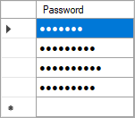

# DataGridView Password Column
This example shows how to create a password column for `DataGridView`.

> Read the full article [here](http://www.reza-aghaei.com/datagridview-password-column/).

There are 3 main pillars for a new column type:

- `DataGridViewColumn` is responsible for properties which you set in design mode in column editor of the control.
- `DataGridViewCell` is responsible for rendering the value and initialize the editing control.
- `DataGridViewEditingControl` is responsible for editing the value of the cell.

To create a a password column called `DataGridViewPasswordColumn`, for the column we can derive from `DataGridViewTextBoxColumn`. For the cell we can derive from `DataGridViewTextBoxCell` and for the editing control we don’t need to do anything other than configuring the default editing control of the `DataGridViewTextBoxCell`.

We need a property called `UsePasswordCharWhenEditing` which tells us if we should use the password character when editing the field.

